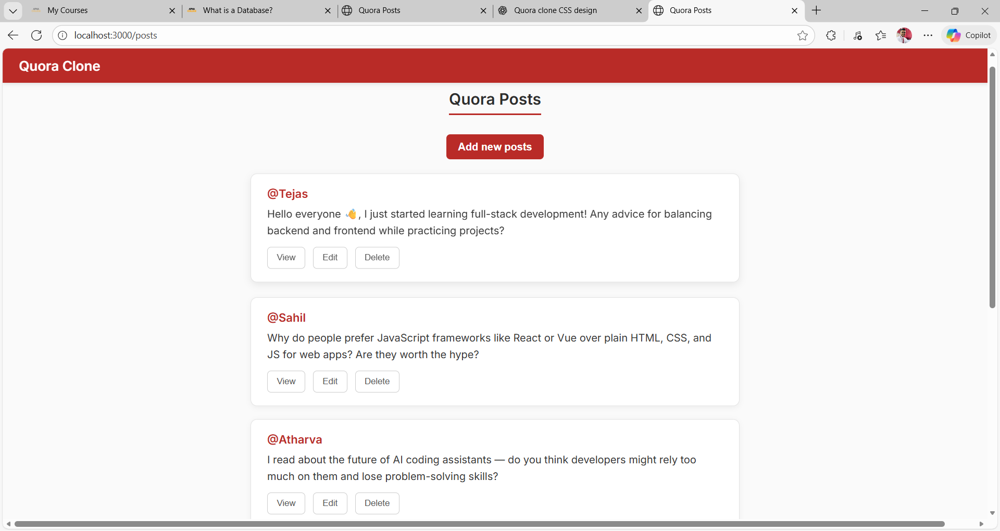

# 🧠 Quora Clone (Express + EJS + REST)

A simple yet elegant **Quora-like web app** built using **Node.js, Express, and EJS** templating.  
Users can **create, view, edit, and delete** posts — all with a clean Quora-inspired UI design.

---

## 🚀 Features

✅ Create a new post  
✅ View any post in detail  
✅ Edit or update existing posts  
✅ Delete posts  
✅ RESTful routes using Express  
✅ Fully responsive modern UI (Quora-style theme)  
✅ Clean folder structure (public / views separation)  
✅ Styled with pure CSS (no frameworks)

---

## 🧩 Tech Stack

| Category | Technology Used |
|-----------|----------------|
| Backend | Node.js, Express.js |
| Frontend | EJS Templates |
| Styling | Custom CSS (Quora-inspired) |
| Tools | UUID for unique IDs |
| Method Override | For PATCH and DELETE routes |

---

## 📁 Folder Structure

REST/<br>
│<br>
├── index.js # Main server file<br>
├── package.json<br>
├── package-lock.json<br>
│<br>
├── 📁 public/ # Static assets<br>
│ ├── 📁 css/<br>
│ │ ├── style.css # Main Feed Page<br>
│ │ ├── new.css # Add Post Page<br>
│ │ ├── edit.css # Edit Post Page<br>
│ │ └── show.css # Post Detail Page<br>
│ │<br>
│ └── 📁 js/ # (optional scripts)<br>
│<br>
├── 📁 views/ # EJS templates<br>
│ ├── index.ejs # Home - all posts<br>
│ ├── new.ejs # Add new post<br>
│ ├── edit.ejs # Edit existing post<br>
│ └── show.ejs # View post detail<br>
│<br>
└── README.md<br>

---

## 🌐 RESTful Routes

| HTTP Method | Route | Description |
|--------------|-------|-------------|
| **GET** | `/posts` | Show all posts |
| **GET** | `/posts/new` | Form to add new post |
| **POST** | `/posts` | Add a new post |
| **GET** | `/posts/:id` | Show a specific post |
| **GET** | `/posts/:id/edit` | Form to edit a post |
| **PATCH** | `/posts/:id` | Update a specific post |
| **DELETE** | `/posts/:id` | Delete a post |

> Method Override is used to support PATCH and DELETE in HTML forms.

---

## 🎨 UI Overview
## 🏠 Main Page (All Posts)

Displays all user posts in card layout

Buttons: View, Edit, Delete

## 📝 Add Post

Simple form with username and content

Clean Quora red-accent design

## ✏️ Edit Post

Update existing post with content editor

“Save” and “Cancel” options

## 👁️ View Post

Shows post details in styled card format

---

## 📸 Screenshots



---

## ⚙️ Installation & Setup

1. **Clone the repository**
   ```bash
   git clone https://github.com/your-username/quora-clone.git
   cd REST
2. **To run the code**
   http://localhost:3000/posts

